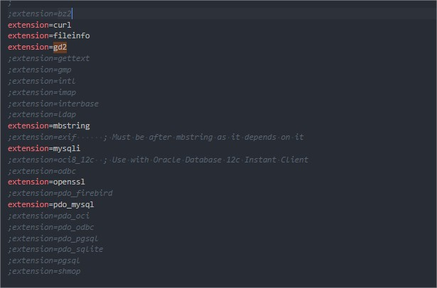

## Web Development 2

### How To Start:

1. Make a folder on your local pc
2. Download fundtime project https://github.com/nawatend/fundtime
3. In terminal, locate root folder of fundtime project(thus where package.json file is)
4. Execute **npm install** in terminal
5. Execute **composer install** in terminal
6. Execute **php artisan key:generate** in terminal
7. Make a .env file in root
```javascript

APP_NAME=FundTime
APP_ENV=local
APP_KEY=xxxxxxxxxxxxxxxxxxxxxxxxxxxxxxxxxxx
APP_DEBUG=true
APP_URL=http://localhost

LOG_CHANNEL=stack

DB_CONNECTION=mysql
DB_HOST=127.0.0.1
DB_PORT=3306
DB_DATABASE=fundtime
DB_USERNAME=root
DB_PASSWORD=root

BROADCAST_DRIVER=log
CACHE_DRIVER=file
QUEUE_CONNECTION=sync
SESSION_DRIVER=file
SESSION_LIFETIME=120

REDIS_HOST=127.0.X.X
REDIS_PASSWORD=null
REDIS_PORT=6379

MAIL_DRIVER=mailgun
MAIL_HOST=smtp.mailgun.org
MAIL_PORT=587
MAIL_USERNAME=postmaster@xxxxxxxxxxxxxxxxxxxxxxxxxxxxxxxxxxx.mailgun.org
MAIL_PASSWORD=xxxxxxxxxxxxxxxxxxxxxxxxxxxxxxxxxxxxxxxxxxxxxxxxxxxxxxxxxxxxxxxxxxxxxx
MAILGUN_DOMAIN=xxxxxxxxxxxxxxxxxxxxxxxxxxxxxxxxxxx.mailgun.org
MAILGUN_SECRET=xxxxxxxxxxxxxxxxxxxxxxxxxxxxxxxxxxx-xxxxxxxxxx-xxxxxxxxxx
MAIL_FROM_ADDRESS=postmaster@xxxxxxxxxxxxxxxxxxxxxxxxxxxxxxxxxxx.mailgun.org
MAIL_FROM_NAME="Fund Time By Nawang Tendar"
MAIL_ENCRYPTION=tls

AWS_ACCESS_KEY_ID=
AWS_SECRET_ACCESS_KEY=
AWS_DEFAULT_REGION=us-east-1
AWS_BUCKET=

PUSHER_APP_ID=
PUSHER_APP_KEY=
PUSHER_APP_SECRET=
PUSHER_APP_CLUSTER=mt1

MIX_PUSHER_APP_KEY="${PUSHER_APP_KEY}"
MIX_PUSHER_APP_CLUSTER="${PUSHER_APP_CLUSTER}"

STRIPE_KEY=pk_xxxxxxxxxxxxxxxxxxxxxxxxxxxxxxxxxxx
STRIPE_SECRET=sk_xxxxxxxxxxxxxxxxxxxxxxxxxxxxxxxxxxx
CREDIT_RATIO=1


```
8. Your php.ini file extensions:

